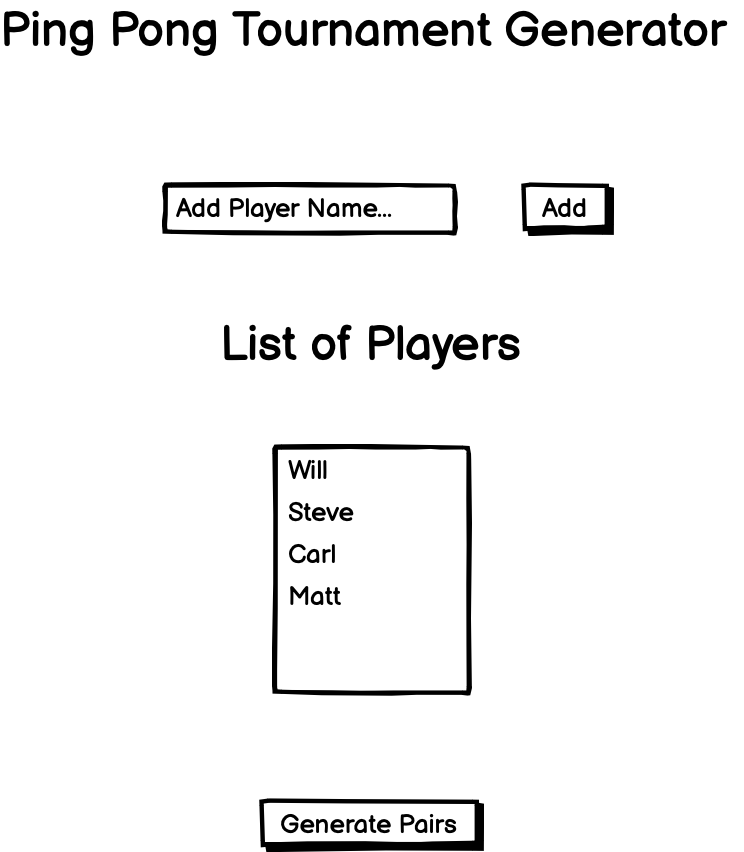
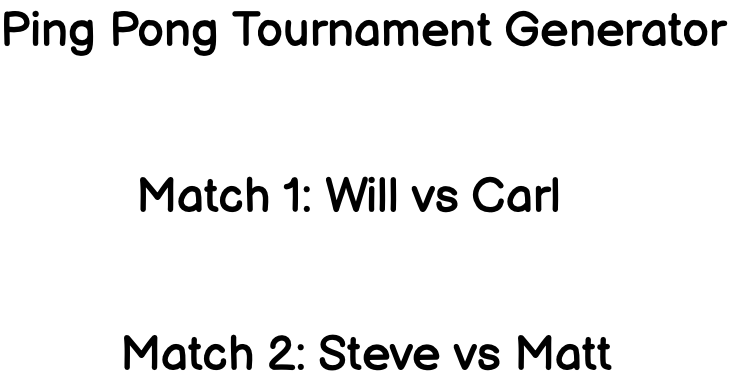

# PingPongTournamentGenerator
Technical code challenge set as the final component of the DevelopMe Coding Fellowship.
Live site can be viewed here: https://williambraney.github.io/PingPongTournamentGenerator/

## Technology/Skills Used
React, Redux, Javascript, HTML, CSS, Git, Wireframing.

## Setup & Running Project
Instructions to setup and run the project locally, npm package manager is required.
Clone the git repo
```
git clone git@github.com:Williambraney/PingPongTournamentGenerator.git
```
Run npm install
```
npm install
```
Run npm start, when packages are finished installing. Page will be viewable on localhost:3000
```
npm start

```
## The Brief
The core of the challenge is to create a tool which randomly creates pairings for a table tennis tournament bracket from a list of names collected from the user.

It's up to you how you implement this, with JavaScript, React, or PHP, as a web page, or as an app.

Some optional advanced features might include:
ability to record scores for each player, or mark which player won from each pairing, to create the next round of the tournament playoffs
continued rounds created until the final (last 2 players who have won all matches to date play each other, one marked as the winner)

## MVP
* An input field in which the user may enter players
* A submit button which stores names in a list
* When submitted players will be shuffled into a list of matches

## Wireframes
Wireframe for initial page

wireframe for results of random pairing



## Stretch Features
1. With more time i would like to implement some error handling. This could include features to stop an incorrect player amount inputted or when an insufficient number of winners had been seleted.
2. Would like to include a scoring system for the players games in order to keep a tally of who would be winning. This could lead to a change in winning scores, and serving.
## App Features
1. Enables users to add names of their choice into a list of names which are displayed. Can add names by pressing the Enter button for convienence.
2. A list of names is generated, to which can be seen below the name add component. 
3. The players list can be cleared in order to start again or can delete the last players name entered. After Four names have been entered a generate teams button will appear in order to start the game.
4. The generate teams button will pair the players whilst shuffling the names to create random pairs. 
5. A reshuffle button if the user wants to change the selected pairs.
6. A feature to select the winnner from each game whilst displaying the winners below. Winners will be entered and shuffled again into the new round, indication of which round  will be displayed at the top of the screen.
7. A knockout feature that will then present the winner of the games with a celebration page.
8. A feature to create a new tournament
## Testing
The web app has been tested across a range of devices (desktop, tablet, phones) and across a range of browsers (Safari, Firefox, Chrome, IE). Accessibility had a score of 100 on all pages. Testing has also been taken to ensure the website is fully responsive to all screen sizes. The intial CSS animation on the landing page has been removed for smaller screens to decrease performance issues.
## What I Would Like To Change
1. If more time was presented i would like to implement SASS as oppose to regular CSS.
2. Would like to create a database storage in Laravell that would store names and scores from previous games.
